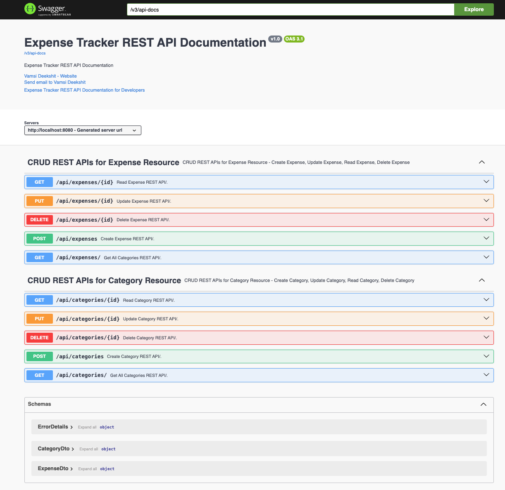

# Expense Tracker App

## Overview
The **Expense Tracker Application** is a comprehensive solution designed to help users efficiently manage their finances by tracking expenses across different categories. This application provides a seamless interface for users to categorize expenses, monitor financial outflows, and maintain better financial planning.

## Features
### 1. Category Management
- Create new categories.
- Retrieve details of a specific category.
- List all available categories.
- Update existing categories.
- Delete categories.

### 2. Expense Management
- Add new expenses under specific categories.
- Retrieve details of a specific expense.
- List all available expenses.
- Update existing expenses.
- Delete expenses.

### 3. Exception Handling
- Implements `@ControllerAdvice` and `@ExceptionHandler` for centralized exception handling.
- Uses `ResourceNotFoundException` for custom error responses.
- Provides structured error messages through `ErrorDetails` class.
- Global exception handling with `GlobalExceptionHandler`.

### 4. REST API Documentation
- Uses **SpringDoc OpenAPI** for automated API documentation generation.
- Generates documentation in **JSON/YAML** and **HTML** formats.
- Supports OpenAPI 3, Spring Boot v3, JSR-303 validations, Swagger-UI, and OAuth 2 authentication.

## Technology Stack
- **Backend**: Spring Boot (Java 17 & Jakarta EE 9)
- **Database**: MySQL
- **API Documentation**: SpringDoc OpenAPI
- **Build Tool**: Maven

## Setup and Installation
### Prerequisites
- Java 17+
- Maven
- MySQL (Configured with the correct credentials in `application.properties`)
